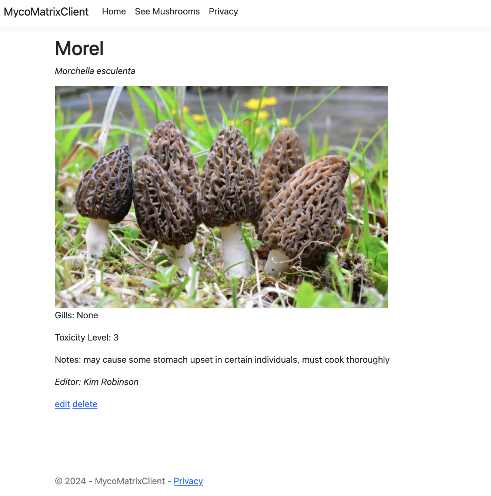

# Communicating with an API
### by Henry Oberholtzer & Kim Robinson

## Prompt
* API-Consuming Application
 Build an application that interacts with an API (using ). 

A user can:
- register an account with the API
- sign in to receive a JWT token to make API calls
 - see the list of mushrooms (GetAll) api call
 - see an individual mushroom's details (Get by id) api call
 - create a mushroom object (Post) api call
 - edit an individual mushroom (Put) api call
 - delete an individual mushroom (Delete) api call

 21 feb 2024
 full CRUD for UI to interact with API without authorization
 22 feb 2024
 full CRUD for authenticated user

 ### issues: had to remove editor check in controller, have not built out user to be associated as editor to only be able to edit/delete their own objects.  